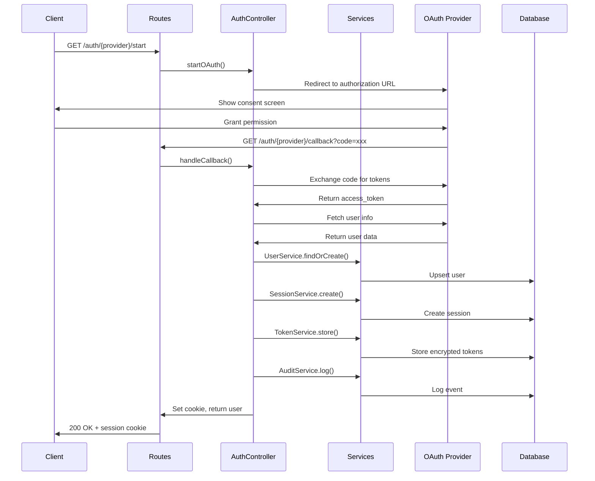

# User Microservice Architecture

This document provides a comprehensive overview of the user-ms architecture, design patterns, and system components.

## Table of Contents

- [Overview](#overview)
- [System Architecture](#system-architecture)
- [Technology Stack](#technology-stack)
- [Design Patterns](#design-patterns)
- [Data Models](#data-models)
- [Request Flow](#request-flow)
- [Plugin System](#plugin-system)
- [Security Architecture](#security-architecture)

---

## Overview

The **user-ms** is a production-ready authentication and user management microservice built with **Fastify** and **TypeScript**. It handles user authentication (OAuth 2.0 and local), session management, profile management, and role-based access control.

### Key Responsibilities

- 🔐 **Authentication** - OAuth 2.0 (Google, GitHub, Facebook, Discord, LinkedIn) + Local auth
- 👤 **User Management** - Profile CRUD, avatar handling
- 📍 **Address Management** - User shipping addresses
- 🎫 **Session Management** - JWT-based sessions with device tracking
- 👥 **Role Management** - Dynamic RBAC implementation
- 📊 **Audit Logging** - Comprehensive security event logging

---

## System Architecture

```
┌─────────────────────────────────────────────────────────────────────────────┐
│                           CLIENT APPLICATIONS                                │
│                    (Web App, Mobile App, Admin Panel)                        │
└───────────────────────────────┬─────────────────────────────────────────────┘
                                │ HTTP/HTTPS
                                ▼
┌─────────────────────────────────────────────────────────────────────────────┐
│                              API GATEWAY                                     │
│                          (Optional Layer)                                    │
└───────────────────────────────┬─────────────────────────────────────────────┘
                                │
                                ▼
┌─────────────────────────────────────────────────────────────────────────────┐
│                           USER-MS SERVICE                                    │
│  ┌─────────────────────────────────────────────────────────────────────┐    │
│  │                         FASTIFY CORE                                 │    │
│  │  ┌───────────┬──────────────┬───────────────┬──────────────────┐   │    │
│  │  │  Helmet   │    CORS      │  Rate Limit   │    Cookie/JWT    │   │    │
│  │  └───────────┴──────────────┴───────────────┴──────────────────┘   │    │
│  └─────────────────────────────────────────────────────────────────────┘    │
│                                    │                                         │
│  ┌─────────────────────────────────▼───────────────────────────────────┐    │
│  │                           ROUTES LAYER                               │    │
│  │    /api/auth  │  /api/user  │  /api/roles  │  /api/addresses       │    │
│  └─────────────────────────────────────────────────────────────────────┘    │
│                                    │                                         │
│  ┌─────────────────────────────────▼───────────────────────────────────┐    │
│  │                       CONTROLLERS LAYER                              │    │
│  │  AuthController │ UserController │ RoleController │ AddressController│   │
│  └─────────────────────────────────────────────────────────────────────┘    │
│                                    │                                         │
│  ┌─────────────────────────────────▼───────────────────────────────────┐    │
│  │                        SERVICES LAYER                                │    │
│  │  UserService │ SessionService │ TokenService │ AuditService │ ...   │    │
│  └─────────────────────────────────────────────────────────────────────┘    │
│                                    │                                         │
│  ┌─────────────────────────────────▼───────────────────────────────────┐    │
│  │                         PRISMA ORM                                   │    │
│  └─────────────────────────────────────────────────────────────────────┘    │
└───────────────────────────────┬─────────────────────────────────────────────┘
                                │
                                ▼
┌─────────────────────────────────────────────────────────────────────────────┐
│                         POSTGRESQL (Neon)                                    │
│   Users │ Sessions │ Tokens │ Addresses │ Roles │ AuditLogs │ Providers    │
└─────────────────────────────────────────────────────────────────────────────┘
```

---

## Technology Stack

| Layer | Technology | Purpose |
|-------|------------|---------|
| **Runtime** | Node.js 18+ | JavaScript runtime |
| **Framework** | Fastify 4.x | High-performance web framework |
| **Language** | TypeScript 5.x | Type-safe JavaScript |
| **ORM** | Prisma 5.x | Database client and migrations |
| **Database** | PostgreSQL (Neon) | Serverless PostgreSQL |
| **Auth** | JWT + OAuth 2.0 | Token-based authentication |
| **Validation** | Zod | Schema validation |
| **Logging** | Pino | Structured JSON logging |

---

## Design Patterns

### MVC Architecture

```
┌─────────────────────────────────────────────────────────────┐
│                         ROUTES (View)                        │
│  • Define HTTP endpoints and request/response schemas        │
│  • Map URLs to controller methods                            │
│  • Handle request validation via Zod schemas                 │
└──────────────────────────┬──────────────────────────────────┘
                           │
┌──────────────────────────▼──────────────────────────────────┐
│                     CONTROLLERS (Controller)                 │
│  • Orchestrate business logic                                │
│  • Handle authentication/authorization                       │
│  • Coordinate between services                               │
│  • Format HTTP responses                                     │
└──────────────────────────┬──────────────────────────────────┘
                           │
┌──────────────────────────▼──────────────────────────────────┐
│                      SERVICES (Model)                        │
│  • Encapsulate data access logic                             │
│  • Implement business rules                                  │
│  • Interact with Prisma ORM                                  │
│  • Handle external API calls (OAuth providers)               │
└─────────────────────────────────────────────────────────────┘
```

### Plugin-Based Architecture

Fastify's plugin system enables modular, encapsulated functionality:

```
plugins/
├── config.ts         # Configuration loader
├── database.ts       # Prisma client initialization
├── jwt.ts            # JWT signing/verification
├── cookie.ts         # Cookie management
├── cors.ts           # CORS configuration
├── helmet.ts         # Security headers
├── rateLimit.ts      # Rate limiting
├── errorHandler.ts   # Global error handling
├── sensible.ts       # HTTP utilities
└── oauth/
    ├── google.ts     # Google OAuth 2.0
    ├── github.ts     # GitHub OAuth 2.0
    ├── facebook.ts   # Facebook OAuth 2.0
    ├── discord.ts    # Discord OAuth 2.0
    └── linkedin.ts   # LinkedIn OAuth 2.0
```

---

## Data Models

### Entity Relationship Diagram

```
┌─────────────┐       ┌────────────────────┐       ┌─────────────┐
│    User     │───┬───│  ProviderAccount   │       │    Role     │
├─────────────┤   │   ├────────────────────┤       ├─────────────┤
│ id          │   │   │ id                 │       │ id          │
│ email       │   │   │ userId      (FK)   │       │ name        │
│ name        │   │   │ provider           │       │ description │
│ avatar      │   │   │ providerUserId     │       └─────────────┘
│ password    │   │   │ metadata           │             ▲
│ createdAt   │   │   └────────────────────┘             │
│ updatedAt   │   │                                      │
└─────────────┘   │   ┌────────────────────┐             │
      │           ├───│     Session        │             │
      │           │   ├────────────────────┤    Many-to-Many
      │           │   │ id                 │             │
      │           │   │ sessionId          │             │
      │           │   │ userId      (FK)   │─────────────┘
      │           │   │ expiresAt          │
      │           │   │ device             │
      │           │   │ userAgent          │
      │           │   │ ipAddress          │
      │           │   └────────────────────┘
      │           │
      │           ├───│     Token          │
      │           │   ├────────────────────┤
      │           │   │ id                 │
      │           │   │ userId      (FK)   │
      │           │   │ provider           │
      │           │   │ accessToken        │
      │           │   │ refreshToken       │
      │           │   │ expiresAt          │
      │           │   └────────────────────┘
      │           │
      │           ├───│    Address         │
      │           │   ├────────────────────┤
      │           │   │ id                 │
      │           │   │ userId      (FK)   │
      │           │   │ street, city, ...  │
      │           │   │ type               │
      │           │   │ isDefault          │
      │           │   └────────────────────┘
      │           │
      │           └───│    AuditLog        │
      │               ├────────────────────┤
      │               │ id                 │
      │               │ userId      (FK)   │
      │               │ event              │
      │               │ metadata           │
      │               │ ipAddress          │
      │               │ timestamp          │
      │               └────────────────────┘
```

### Model Descriptions

| Model | Purpose | Key Fields |
|-------|---------|------------|
| **User** | Core user identity | email, name, avatar, password |
| **Role** | RBAC permissions | name, description |
| **Address** | Shipping addresses | street, city, state, country, isDefault |
| **ProviderAccount** | OAuth provider links | provider, providerUserId, metadata |
| **Session** | Active user sessions | sessionId, device, expiresAt |
| **Token** | OAuth tokens (encrypted) | accessToken, refreshToken |
| **AuditLog** | Security event log | event, metadata, ipAddress |

---

## Request Flow

### Authentication Flow (OAuth)



### Protected Route Flow

```
┌─────────┐     ┌──────────┐     ┌────────────┐     ┌────────────┐
│ Request │────▶│ Validate │────▶│ Controller │────▶│  Response  │
│ + Cookie│     │   JWT    │     │   Method   │     │   + Data   │
└─────────┘     └──────────┘     └────────────┘     └────────────┘
                     │
                     ▼
              ┌────────────┐
              │  Verify    │
              │  Session   │
              │  in DB     │
              └────────────┘
```

---

## Plugin System

### Plugin Loading Order

Plugins are auto-loaded in alphabetical order. Dependencies are managed via Fastify's `dependsOn` option.

```
1. config.ts       → Loads environment configuration
2. cookie.ts       → Cookie parser (depends: config)
3. cors.ts         → CORS middleware (depends: config)
4. database.ts     → Prisma client (depends: config)
5. errorHandler.ts → Global error handler
6. helmet.ts       → Security headers
7. jwt.ts          → JWT utilities (depends: config)
8. oauth/*.ts      → OAuth providers (depends: config, jwt)
9. rateLimit.ts    → Rate limiting (depends: config)
10. sensible.ts    → HTTP utilities
```

### Creating a New Plugin

```typescript
import fp from "fastify-plugin";
import type { FastifyInstance } from "fastify";

export default fp(
  async (fastify: FastifyInstance) => {
    // Plugin logic here
    fastify.decorate("myPlugin", { ... });
  },
  {
    name: "my-plugin",
    dependencies: ["config-plugin"],
  }
);
```

---

## Security Architecture

### Authentication Layers

```
┌─────────────────────────────────────────────────────────────┐
│                    SECURITY LAYERS                           │
├─────────────────────────────────────────────────────────────┤
│  1. HELMET        │  Security headers (CSP, HSTS, etc.)     │
├───────────────────┼─────────────────────────────────────────┤
│  2. CORS          │  Origin-based access control             │
├───────────────────┼─────────────────────────────────────────┤
│  3. RATE LIMIT    │  Request throttling per IP               │
├───────────────────┼─────────────────────────────────────────┤
│  4. JWT           │  Token verification and signing          │
├───────────────────┼─────────────────────────────────────────┤
│  5. SESSION       │  Database-backed session validation      │
├───────────────────┼─────────────────────────────────────────┤
│  6. AUDIT         │  Comprehensive event logging             │
└───────────────────┴─────────────────────────────────────────┘
```

### Security Features

| Feature | Implementation |
|---------|---------------|
| **Password Hashing** | bcrypt with 10 salt rounds |
| **Token Storage** | Encrypted in database |
| **Session Cookies** | HttpOnly, Secure, SameSite |
| **Rate Limiting** | Configurable per-endpoint |
| **CORS** | Whitelist-based origin control |
| **SQL Injection** | Prisma parameterized queries |
| **XSS Protection** | Helmet security headers |

---

## Directory Structure

```
user-ms/
├── prisma/
│   └── schema.prisma         # Database schema
├── src/
│   ├── app.ts                # Application bootstrap
│   ├── server.ts             # Server entry point
│   ├── constants.ts          # Centralized constants
│   ├── config/               # Configuration loader
│   ├── controllers/          # Business logic (5 controllers)
│   ├── routes/               # HTTP endpoints (5 route files)
│   ├── services/             # Data access layer (6 services)
│   ├── plugins/              # Fastify plugins (10 + 5 OAuth)
│   ├── middleware/           # Request interceptors
│   ├── schemas/              # Zod validation schemas
│   ├── types/                # TypeScript declarations
│   ├── utils/                # Utility functions
│   └── generated/            # Prisma generated client
├── docs/                     # Documentation
├── package.json
└── tsconfig.json
```

---

## Related Documentation

- [DEVELOPMENT.md](./DEVELOPMENT.md) - Development setup and guidelines
- [FEATURES.md](./FEATURES.md) - Feature documentation and API reference
